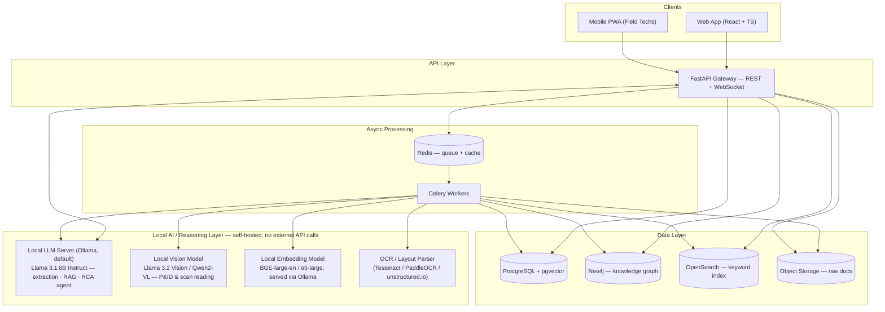

# Inspiron — Industrial Knowledge Intelligence Platform
### Build Plan — final scope, what is to be done, phase-by-phase testing gates

---

## 1. Final scope decision (locked)

Time is limited. Building all 5 illustrative modules from the brief is not realistic and produces five shallow demos instead of one strong one. **Decision — build exactly 3 modules, deep:**

| # | Module | Status | Why chosen |
|---|---|---|---|
| 1 | Universal Document Ingestion & Knowledge Graph | **Build — Phase 1** | Mandatory foundation. Every other module reads from this. |
| 2 | Expert Knowledge Copilot (RAG chat) | **Build — Phase 2** | Highest-leverage demo feature. This is what judges will personally interact with. |
| 3 | Maintenance Intelligence & RCA Agent | **Build — Phase 3** | Maps directly to the brief's own headline stat (18–22% of unplanned downtime caused by fragmented equipment history) — strongest Business Impact story, and an agentic tool-use demo is the strongest Technical Excellence / Innovation story. |
| 4 | Quality & Regulatory Compliance Intelligence | **Not built** | Cut. Requires sourcing real regulatory text to be credible — highest data-sourcing risk for lowest incremental demo value once RCA already proves the agentic-reasoning story. Document as roadmap only. |
| 5 | Lessons Learned & Failure Intelligence Engine | **Not built** | Cut. Conceptually overlaps RCA once the knowledge graph exists. Document as roadmap only. |

This is final — do not re-litigate scope mid-build. If time remains after Phase 3 passes its testing gate, extend Phase 3 (better RCA evidence quality, more seeded scenarios) rather than starting a 4th module.

---

## 2. UI/UX — built once, completely, in Phase 0

Every screen below is designed and built in Phase 0, against mock/fixture data. It never gets rebuilt — later phases only replace the data source.

**Global shell:** role switcher (Field Technician / Maintenance Engineer / RCA Lead / Admin) · command palette (`Cmd/Ctrl+K`) · global search · notification center · responsive: desktop, tablet, mobile PWA.

**Screens to build:**
1. **Home / Command Center** — role-adaptive dashboard, "Ask anything" entry point.
2. **Document Library** — Ingestion Queue (upload + per-file status) · Document Browser · Document Viewer (entity overlay + confidence panel) · P&ID Viewer (zoomable, tag hotspots).
3. **Knowledge Graph Explorer** — interactive graph, Equipment 360° panel, natural-language path query.
4. **Expert Knowledge Copilot** — chat, citations with confidence + jump-to-document, mobile-first, voice input, conversation history.
5. **Maintenance Intelligence & RCA** — Equipment Health Dashboard · Work Order Explorer · RCA Workspace (5-whys/fishbone canvas, AI-drafted evidence-linked root cause) · Maintenance Schedule view.
6. **Admin & Settings** — connectors, ingestion monitor (doubles as the extraction-accuracy screen for judges), user/role management.

Modules 4 (Compliance) and 5 (Lessons Learned) get **no screens** — don't build UI for features that won't have a backend; that's a stub, which the brief's UX bar doesn't allow. If they get added later, that's a new phase with its own Phase-0-style UI addition.

**Exit criterion (Phase 0):** every screen above is reachable, navigable, and visually finished on mock data. Nothing says "coming soon."

---

## 3. Architecture



**Stack:** FastAPI (async) · Neo4j (graph) · PostgreSQL + pgvector or dedicated vector store · OpenSearch (hybrid keyword+vector retrieval) · Celery + Redis (async ingestion) · React + TypeScript + Tailwind/shadcn (frontend) · **local, self-hosted LLM serving** as the reasoning core — no Claude/OpenAI/any external model API calls anywhere in the pipeline (see §5). This means: zero per-token API cost, no internet dependency at inference time, and — the real selling point for this industry — **plant documents never leave the plant network**, which is a hard deployment requirement at many real industrial sites that legally/contractually cannot send P&ID or SCADA data to a third-party API.

---

## 4. Knowledge graph ontology

**Entities:** `Equipment` · `Document` · `Person` · `ProcessParameter` · `WorkOrder` · `Procedure`/`SOP` · `InspectionRecord` · `Incident` · `Unit`.

**Relationships:** `Document -[MENTIONS]-> Equipment` · `Equipment -[PART_OF]-> Unit` · `WorkOrder -[PERFORMED_ON]-> Equipment` · `WorkOrder -[PERFORMED_BY]-> Person` · `Procedure -[APPLIES_TO]-> Equipment` · `InspectionRecord -[FOUND_ON]-> Equipment` · `Incident -[INVOLVES]-> Equipment` · `Incident -[ROOT_CAUSE_CHAIN]-> Incident|Equipment|Procedure`.

Extraction targets: equipment tags, process parameters, personnel, dates. (`RegulatoryReference` entity and its relationships are dropped along with the Compliance module — remove from ontology, don't build unused schema.)

---

## 5. Local LLM layer — no external API, self-hosted only

**Decision: this platform calls no hosted LLM API (not Claude, not OpenAI, not anything) for any query.** Every extraction, RAG answer, and RCA reasoning step runs against a model you serve yourself. This is a deliberate architecture choice, not a fallback — it removes per-token cost, removes internet dependency at inference time, and (the real story) means plant documents never leave the plant network, which is a genuine deployment blocker this platform now solves for real industrial customers.

### Serving

**Ollama** (default) — one binary, runs on CPU or GPU, pulls quantized GGUF models, exposes an OpenAI-compatible REST API so the rest of the stack (FastAPI, Celery) talks to it exactly like it would talk to any hosted API — swapping models later is a config change, not a rewrite.

**Scale-up path (not needed for the hackathon build, but the honest answer for the Scalability story):** vLLM for higher-throughput multi-user serving with automatic prefix caching, once this moves past a single-machine demo.

### Model tiering — pick based on the hardware actually available

| Hardware | Default model | Notes |
|---|---|---|
| CPU-only / <8GB VRAM | `llama3.1:8b-instruct-q4_K_M` (or `qwen2.5:7b-instruct`) | Usable for extraction + RAG synthesis; slower generation; this is the safe baseline — assume this unless told otherwise. |
| 8–16GB VRAM | Same model, `q8` or unquantized | Materially faster, same quality ceiling. |
| 24GB+ VRAM / multi-GPU | `qwen2.5:14b-instruct` or `qwen2.5:32b-instruct` for **Phase 3 (RCA) specifically** | Swap in only where reasoning quality matters most; keep the smaller model for high-volume Phase 1 extraction to stay fast. |

**Default assumption for this plan: 8B-class quantized model everywhere, upgraded for Phase 3 only if better hardware is confirmed available.** State the actual hardware before Phase 1 starts so this table isn't guessed.

### Capability mapping

| Capability | Phase | Mechanism (local equivalent of what a hosted API would give for free) |
|---|---|---|
| Structured entity extraction | 1 | No managed structured-output API locally — use constrained decoding (`Outlines` or `Instructor` against Ollama's OpenAI-compatible endpoint) to force valid JSON matching the entity schema, then validate with Pydantic and retry on failure. |
| Document vision (P&IDs, scans) | 1 | Local vision-language model (`Llama 3.2 Vision 11B` or `Qwen2-VL 7B`) as a **secondary** pass only — local VLMs are meaningfully weaker than a frontier hosted model at this. Classical OCR + layout parsing (Tesseract/PaddleOCR + `unstructured.io`) is the **primary, load-bearing** extraction path. Say this plainly in the deck; don't oversell the vision step. |
| RAG synthesis with citations | 2 | Hybrid retrieval feeds top-k chunks into the local model; prompt it to emit inline `[doc_id:chunk_id]` markers, then a post-processing step maps those markers back to source spans for the citation panel. Unlike Claude's `citations` param, this mapping has to be built explicitly — budget real time for it, it's not free. |
| Agentic RCA | 3 | Both Llama 3.1 and Qwen2.5 support native tool/function-calling. Build a lightweight custom tool loop (same shape as before) against the local model's tool-calling API: `search_equipment_history`, `get_work_orders`, `get_similar_incidents`. |
| Repeat-prefix cost reduction | 2, 3 | vLLM automatic prefix caching (or Ollama's session context reuse) — the local equivalent of Claude's prompt caching, cuts latency on repeated system-prompt/context prefixes. |
| Quality/speed tradeoff per task | all | **Model tiering**, not "effort" — route simple Phase 1 extraction to the smaller default model, escalate to the larger model (if hardware allows) only for Phase 3 RCA reasoning, where output quality matters most. |

### Honesty check for the deck

An 8B-class open-weight model will not match a frontier hosted model on complex multi-step reasoning. Mitigate this two ways, both already in the plan: (1) the knowledge graph does more of the reasoning work upfront (structured retrieval beats asking the model to reason from raw text), and (2) tier up to a bigger local model for Phase 3 specifically if hardware allows. Frame the tradeoff to judges as deliberate — **data sovereignty and zero-marginal-cost inference, in exchange for a lower reasoning ceiling than a frontier API** — not as a limitation you're hiding.

---

## 6. Testing gate protocol — applies after every backend phase

**No phase starts until the previous phase's gate passes. This is not optional and not skippable under time pressure — a broken Phase 1 makes every later phase worse, not faster.**

For each phase:
1. **Write tests before or alongside the build** — unit tests for extraction/parsing/retrieval logic, integration tests for every new API endpoint, at least one end-to-end test per new user-facing flow.
2. **Run the full test suite.** Any failure blocks the gate.
3. **Run the phase's specific functional acceptance check** (defined per phase below) against real ingested/seeded data — not mocks.
4. **Bug triage:** log every failure found, fix it, re-run the full suite (not just the failing test — a fix can break something else).
5. **Regression check:** re-run the previous phase's acceptance check too, to confirm this phase didn't break it.
6. **Gate passes** only when: full test suite green, this phase's functional acceptance check passes, previous phases' checks still pass.
7. Only then move to the next phase.

---

## 7. Phase-by-phase — what is to be done

### Phase 0 — Foundation
**Build:**
- [ ] Full UI from §2, wired to mock/fixture API.
- [ ] Provision empty Postgres, Neo4j, Redis, object storage.
- [ ] Scaffold FastAPI project + Celery worker skeleton.

**Testing gate:** smoke test — every screen loads, every nav link resolves, no console errors, responsive breakpoints render correctly on mobile/tablet/desktop.

---

### Phase 1 — Ingestion & Knowledge Graph
**Build:**
- [ ] Upload endpoint → object storage → Celery job.
- [ ] OCR/vision extraction pipeline.
- [ ] Local-LLM structured extraction (equipment tags, parameters, personnel, dates) via constrained decoding (see §5).
- [ ] Write nodes/edges to Neo4j; embed chunks to vector index.
- [ ] Wire Document Library, Document Viewer, Knowledge Graph Explorer, Admin ingestion monitor to real data.

**Testing gate (in addition to protocol above):**
- [ ] Unit tests: extraction schema validation, entity-to-graph mapping logic.
- [ ] Integration tests: upload endpoint, ingestion job status transitions, graph write correctness.
- [ ] **Functional acceptance:** ingest 20+ varied sample documents (P&ID, work order, SOP, inspection report, spreadsheet). Manually verify extracted entities against a hand-labeled subset — record extraction accuracy. Confirm graph traversal returns correct linked records for at least 5 equipment tags.

---

### Phase 2 — Expert Knowledge Copilot
**Build:**
- [ ] Hybrid retrieval (vector + keyword + one-hop graph expansion).
- [ ] Local-LLM streaming synthesis with inline `[doc_id:chunk_id]` citation markers, mapped back to source spans (see §5).
- [ ] WebSocket chat transport.
- [ ] Wire Copilot chat + Home "ask anything" widget to real backend.

**Testing gate:**
- [ ] Unit tests: retrieval ranking, citation-to-source mapping.
- [ ] Integration tests: chat endpoint, streaming response handling, WebSocket reconnect.
- [ ] **Functional acceptance:** run a benchmark set of ≥15 domain-expert questions against the Phase 1 corpus. Every answer must cite a real source document that a human can verify supports the claim. Measure time-to-answer vs. a manual-search baseline.
- [ ] Regression: re-confirm Phase 1 ingestion/graph checks still pass.

---

### Phase 3 — Maintenance Intelligence & RCA Agent
**Build:**
- [ ] Custom tools: `search_equipment_history`, `get_work_orders`, `get_similar_incidents`.
- [ ] Custom tool-use loop (against the local model's native function-calling API) that gathers evidence before drafting an RCA chain.
- [ ] Wire Equipment Health Dashboard, Work Order Explorer, RCA Workspace, Maintenance Schedule view to real backend.

**Testing gate:**
- [ ] Unit tests: each custom tool in isolation (correct query, correct result shape).
- [ ] Integration tests: full tool-use loop end-to-end.
- [ ] **Functional acceptance:** seed ≥3 synthetic failure scenarios with supporting work orders/inspection records. For each, the RCA agent must produce a root-cause chain where every claim links to a real evidence record; a human reviewer confirms the chain is plausible.
- [ ] Regression: re-confirm Phase 1 and Phase 2 checks still pass.

---

### Phase 4 — Demo readiness
**Build:**
- [ ] Seed one coherent, plausible plant's worth of demo data (not random fixtures) so the knowledge graph tells one story across all 3 modules.
- [ ] Performance pass; PWA offline-mode check for field-technician flows.
- [ ] Finalize architecture diagram, deck, demo video.

**Testing gate:** full end-to-end run-through of the demo script (below) with zero manual workarounds.

---

## 8. Permissions, testing & the dev → GitHub → deployment workflow

**Where things actually run:** development happens on this machine. Ollama runs on a separate laptop. The two are connected only through git — nothing in this codebase assumes Ollama is reachable from here.

**How the codebase handles that split — the `LLMClient` abstraction:** every piece of code that talks to the model goes through one interface, never Ollama's SDK directly:

```python
class LLMClient(Protocol):
    def extract_structured(self, prompt: str, schema: type[BaseModel]) -> BaseModel: ...
    def chat_stream(self, messages: list[Message], tools: list[Tool] | None = None) -> Iterator[str]: ...
    def embed(self, texts: list[str]) -> list[list[float]]: ...
```

- `FakeLLMClient` — deterministic, canned responses from fixtures. Backs **every unit and integration test**, so the entire codebase is buildable and testable on this machine with zero Ollama dependency, and it's what CI uses (GitHub Actions has no GPU/Ollama).
- `OllamaLLMClient` — the real adapter, pointed at `OLLAMA_HOST`. Set that to the other laptop's LAN address if it's reachable during development (faster iteration, real inference now), or leave it as `localhost:11434` for when this code actually runs on that laptop. Nothing else in the codebase changes either way — that decision only affects one environment variable.

**Workflow:**
1. Build and commit here.
2. Push to GitHub (`git push` still asks for confirmation every time — kept in the `ask` list below on purpose, not auto-approved).
3. Clone/pull on the Ollama laptop; run there with `OLLAMA_HOST=localhost:11434`.
4. The phase-gate **functional acceptance** check for each phase (§6/§7) — the one requiring real inference — runs on whichever machine actually reaches Ollama. Everything else (unit tests, integration tests, CI) runs anywhere, including this machine, against the fake client.

**Testing feature — `.github/workflows/ci.yml` + `docs/TESTING.md`:** CI runs the automated unit/integration suite (mocked LLM, real Postgres/Neo4j/Redis via service containers) on every push and PR. CI green is necessary but **not sufficient** for a phase gate — the manual functional-acceptance run against real Ollama (§6/§7) is still required before a phase counts as done. Full strategy, the test pyramid, and how to run everything locally: `docs/TESTING.md`.

**Permissions — `.claude/settings.json`:** auto-allows the build/test commands this plan needs (npm/pnpm, python/pip, docker, pytest, vitest, ruff/mypy, git status/diff/add/commit, `gh auth status`/`gh repo view`). Anything that publishes or destroys — `git push`, `gh repo create`, `rm -rf`, `git reset --hard` — still asks for confirmation every time. That's deliberate, not a gap to close.

---

## 9. Judging-criteria mapping

| Criterion | Weight | Addressed by |
|---|---|---|
| Innovation | 25% | Agentic RCA that gathers its own evidence (Phase 3), not one-shot retrieval; fully self-hosted inference is also a differentiator — most competing entries will just wrap a hosted LLM API. |
| Business Impact | 25% | Directly targets the brief's downtime/fragmentation stats via RCA + unified graph; **on-premise inference removes the real deployment blocker** that stops many plants from adopting any cloud-API-based AI tool in the first place (data sovereignty, no P&ID/SCADA data ever leaving the network). |
| Technical Excellence | 20% | Real knowledge graph, hybrid retrieval, constrained-decoding structured extraction, agentic tool use against a self-hosted model, per-phase testing discipline. |
| Scalability | 15% | Async ingestion pipeline, graph DB, containerized services, and a serving layer (Ollama → vLLM) that scales with added GPU nodes at **zero per-token marginal cost** — a real advantage once ingesting an entire plant's document corpus at volume. |
| User Experience | 15% | Full UI built and polished from Phase 0, mobile-first Copilot, citations with jump-to-document. |

---

## 10. Demo script

1. Upload a P&ID + work order + SOP live — watch the graph populate (Phase 1).
2. Ask the Copilot a multi-hop question — show the cited source jump (Phase 2).
3. Walk a seeded failure through the RCA Workspace — show the evidence-linked root-cause chain (Phase 3).
4. Close on the mobile field-technician Copilot view.

## 11. Deliverables

- [ ] Working prototype (Phases 0–3, seeded demo data).
- [ ] Architecture diagram (§3, exported).
- [ ] Presentation deck (problem → scope decision §1 → architecture → demo → metrics).
- [ ] Demo video (script §10).
